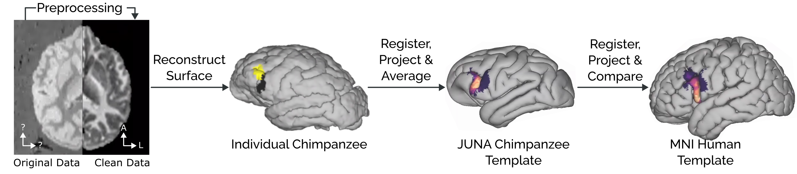
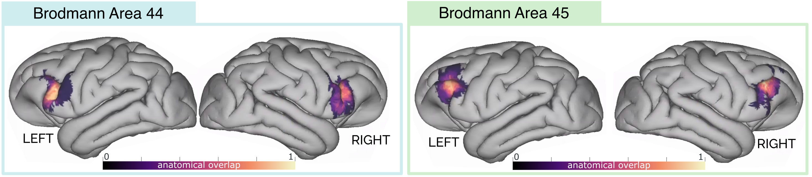
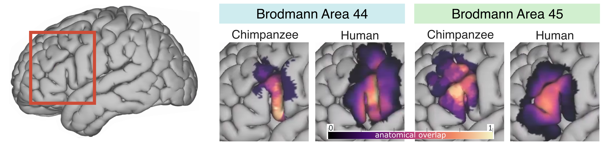

# Uncovering the Morphological Evolution of Language-Relevant Brain Areas

---

# [Results Folder](./results/)
The [`./results`](./results/) folder contains the main results derived from our study.

## Probabilistic Atlas of the Chimpanzee BA44 and BA45
The folder [`./results/chimpanzee-atlas](`./results/chimpanzee-atlas`) contains the probabilistic atlas of cytoarchitectural regions BA44 and BA45 in the chimpanzee template (JUNA).

## Projection of the Chimpanzee BA44 and BA45 to the Human Brain

The folder [`./results/human-comparison](`./results/human-comparison`) contains the following information projected to the MNI surface:
1. The atlases of chimpanzee BA44 and BA45.
2. The atlases of human BA44 and BA45 [1].
3. The functional subdivisions of human BA44 defined by Clos et al. [2] and Papitto et al. [3].

---

# [Scripts Folder](./scripts)
The [`./scripts`](./scripts/) folder contains the scripts used for computing the results from our paper.

## Chimpanzee Atlas Creation
The pipeline used to reconstruct the individual surface, composed by 4 steps:
1. Preprocessing the individual volumes.
2. Processing the individual volumes with Freesurfer.
3. Transforming the surfaces to the GIFTI format (compatible with the [Connectome Workbench](https://www.humanconnectome.org/software/connectome-workbench)).
4. Translating the individual surfaces to the JUNA template space, and averaging them to obtain the atlas.

## Human Comparison
The pipeline used to compare the chimpanzee Broca's atlas with human Broca and its functional subdivisions.

--- 

# References

[1] Amunts K, Schleicher A, Bürgel U, Mohlberg H, Uylings HB, Zilles K. Broca’s region revisited: cytoarchitecture and intersubject variability. J Comp Neurol. 1999;412: 319–341.

[2] Clos M, Amunts K, Laird AR, Fox PT, Eickhoff SB. Tackling the multifunctional nature of Broca’s region meta-analytically: co-activation-based parcellation of area 44. Neuroimage. 2013;83: 174–188.

[3] Papitto G, Friederici AD, Zaccarella E. The topographical organization of motor processing: An ALE meta-analysis on six action domains and the relevance of Broca’s region. Neuroimage. 2020;206: 116321.
