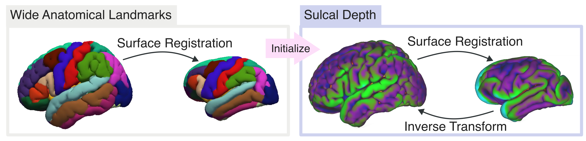

# Comparing the Chimpanzee Broca with its Human Homolog and Functional Subdivisions

This folder contains the scripts used to map the Chimpanzee BA44 and BA45 to the MNI human template (ICBM152 9c Asymmetric), and to compare the overlap with functional subdivisions of the human BA44.

---

## Mapping the Chimpanzee JUNA surface to the Human MNI surface

The pipeline in [./mapping-to-human/project_surface_template.sh](./mapping-to-human/project_surface_template.sh) performs a two step alignment of the human MNI brain with the chimpanzee JUNA brain using [MSM](https://github.com/ecr05/MSM_HOCR).

In the first step we align the brains based on the `aparc` parcelation obtained during the Freesurfer reconstruction. We then align them using the `sulc` (sulcal data depth) information.

Notice that we compute the registration using the MNI template as `moving` and the JUNA template as `fixed`. Meaning that we register the MNI template to the JUNA brain, and then use the inverse transform to project information from the chimpanzee to the human brain. 

---
## Comparing Volumes Across Species 

The file [./roi_volume/1.individual_chimps_to_icbm.sh](./roi_volume/1.individual_chimps_to_icbm.sh) projects the individual chimpanzee projects to the MNI surface, and then projects them to the volumetric MNI space. The algorithm used projects each region (e.g. BA44, BA45) in such a way that it covers only the portion that it corresponds of gray matter.

Then [./roi_volume/2.print_metrics.py](./roi_volume/2.print_metrics.py) simply loads the volumes, and computes the volume occupied by the region, i.e. the amount of voxels that each individual regions covers, and reports its average.

---

## Overlap Between Chimpanzee BA44 and Functional Subdivisions of the Human BA44

The jupyter notebook [Areas Overlap](./Areas%20Overlap.ipynb) loads the chimpanzee BA44 and functional subdivisions of the human BA44, and computes the overlap between them.